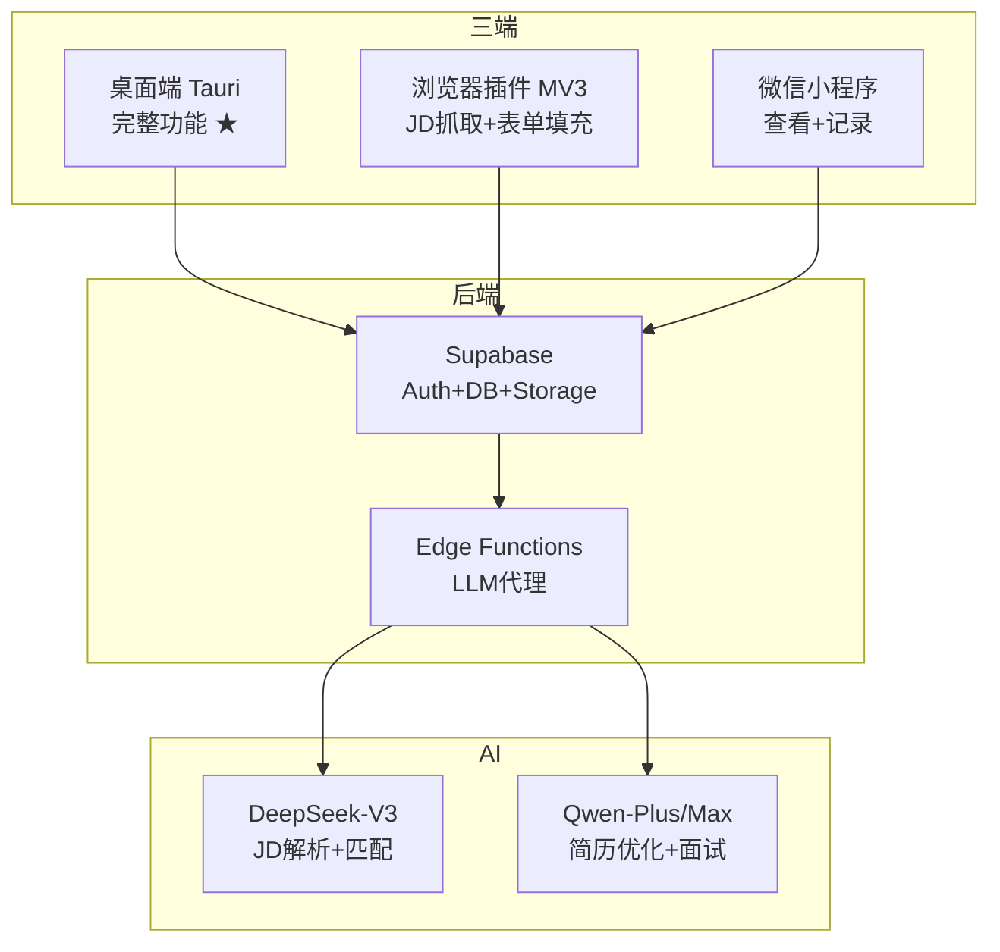
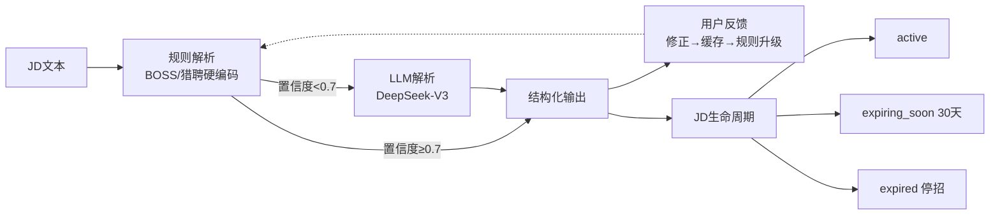
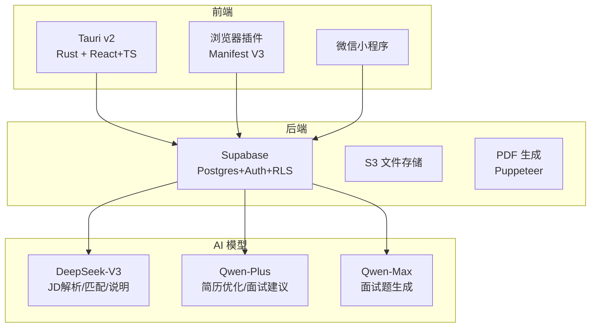
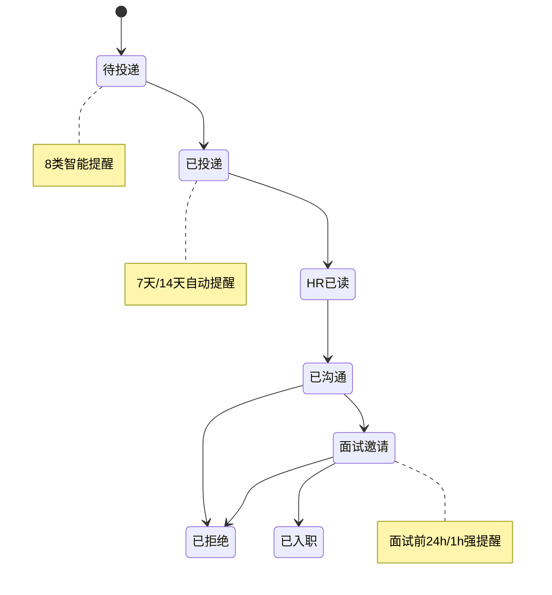
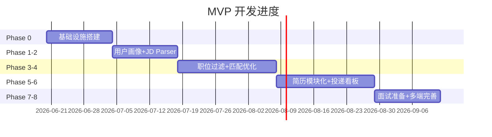

<!-- _class: lead -->

# EveryDeliver

## 求职者半自动投递辅助平台

### 通过 AI 智能筛选与适配提升投递效率

**OPC 能力挑战赛**

---

<!-- _class: default -->

## 痛点分析

### 😫 痛点 1

**多平台搜寻 + 简历定制 + 投递耗时巨大**

- 官网 / 公众号 / BOSS / 猎聘 / 小红书
- 每份岗位需要定制化简历
- 投递后缺乏系统性追踪

### 🤔 痛点 2

**不确定简历与岗位的匹配度**

- 不知道哪里需要修改
- 不知道该突出什么
- 不知道如何提升命中率

---

## 解决方案

### 🎯 核心定位

# AI 驱动的求职效率引擎

### 不是盲投，而是精准适配

**上传简历 → 导入 JD → AI 优化 → 投递追踪**
**一站式闭环**

---

## 产品架构

---

## 8 大功能模块

| 模块 | 核心 |
|------|------|
| **A. 用户画像** | 简历上传 / 隐私分级 / 黑白名单 |
| **B. 职位获取** | 插件抓取 + 手动导入 / 三层过滤 |
| **C. 匹配优化** | 匹配度评估 / AI 简历优化 / 双模式 |
| **D. 投递执行** | 跳转投递 + 插件半自动填充 |
| **E. 追踪看板** | 三视图 / 7状态 / 8类提醒 |
| **F. 简历模块化** | 8类模块 / 拼接 / 5模板 |
| **G. JD Parser** | 规则+LLM三层解析 / 生命周期 |
| **H. 多端架构** | Tauri + 插件 + 小程序 + 云同步 |

---

## 核心亮点：AI 简历优化

### 改动风险 5 级分级

| 级别 | 类型 | 处理 |
|------|------|------|
| 🟢 | 措辞优化 | 自动应用 |
| 🟡 | 侧重点调整 | 自动应用 |
| 🟠 | GitHub化用 | 轻提示 |
| 🔴 | 新增关键词 | 弹窗确认 |
| 🔴 | 新增经历 | 强制确认 |

### 三色高亮 + 面试赋能

黄色 已有改写
橙色 外部参考
红色 新增内容

每处改动附带：
- 改动原因说明
- 参考来源链接
- 面试准备建议

---

## 核心亮点：JD Parser

---

## 核心亮点：隐私保护

### 三级分级存储

| Level | 内容 | 存储 | LLM |
|-------|------|------|-----|
| **L1** | 手机号/身份证/籍贯/生日 | 本地 AES 加密 | ❌ 永不上传 |
| **L2** | 姓名/邮箱/脱敏手机号 | 加密上传 | ❌ 不送 LLM |
| **L3** | 技能/项目/年限/学历 | Supabase | ✅ 脱敏后可送 |

### 关键原则
- 🔒 不存储任何第三方平台密码/Cookies
- 🔒 所有用户数据 RLS 强制隔离
- 🔒 LLM 调用经代理层过滤敏感字段
- 🔒 训练数据 opt-in，默认不参与

---

## 技术栈

---

## AI 模型策略

| 任务 | 模型 | 理由 | 成本 |
|------|------|------|------|
| JD 解析 | DeepSeek-V3 | 便宜稳定 | ¥0.004/JD |
| 简历优化 | Qwen-Plus | 语义改写要求高 | ¥0.03/次 |
| 匹配度评估 | DeepSeek-V3 | 公式化任务 | ¥0.002/次 |
| 改动说明 | DeepSeek-V3 | 模板化生成 | ¥0.001/次 |
| 面试题生成 | Qwen-Max | 质量优先 | ¥0.05/次 |
| 面试建议 | Qwen-Plus | 平衡 | ¥0.02/次 |

### 💰 约 ¥0.86/月/用户

**是 Claude API 的 1/15**

---

## 浏览器插件合规设计

### 🛡️ 法律合规

- ✅ 首次启用强制告知弹窗
- ✅ 用户协议明确声明风险
- ✅ 每月一次重提示
- ✅ 一键禁用按钮

### 🔧 技术安全

- ✅ 借助用户登录态（非爬虫）
- ✅ 模拟真实操作（随机延迟）
- ✅ 不批量抓取（每平台每日上限）
- ✅ 夜间 0-7 点自动暂停

### 🚫 不做的事

- ❌ 不自动提交投递
- ❌ 不存储密码/Cookies
- ❌ 不爬取聊天记录
- ❌ 不修改账号信息

---

## 竞品对比

| 维度 | BOSS直聘 | 猎聘 | 传统手动 | **EveryDeliver** |
|------|---------|------|---------|----------------|
| 多平台聚合 | ❌ | ❌ | ❌ | ✅ 插件+手动 |
| JD 智能解析 | ❌ | ❌ | ❌ | ✅ 规则+LLM |
| 简历 AI 优化 | ❌ | 付费 | ❌ | ✅ 双模式+分级 |
| 投递追踪 | 半自动 | 半自动 | 手动 | ✅ 三视图+提醒 |
| 隐私保护 | ❌ | ❌ | — | ✅ 三级分级 |
| 成本 | 免费 | 付费 | 时间 | ¥0.86/月 |

---

## 投递追踪看板

---

## 简历模块化系统

### 8 类模块
- 🎓 教育背景
- 💼 实习经历
- 📁 项目经历
- 🛠️ 技能证书
- 📜 资质证书
- 🏆 获奖荣誉
- 🌐 语言能力
- 📝 个人总结

### 5 套模板
- 极简经典（技术岗）
- 应届清新（应届生）
- 双栏商务（外企/管理）
- 英文标准（外企/海归）
- 创意视觉（设计/创意）

### 5 维质检
- ⏰ 陈旧检测
- 📏 简略检测
- 📊 缺量化检测
- 🏷️ 无标签检测
- ⚡ 时间冲突检测

---

## 项目进度

---

## AI 协作方式

### 本项目由"人 + AI"协作开发

| 环节 | AI 做的 | 人做的 |
|------|---------|--------|
| 需求分析 | 🔍 挖掘痛点、发现模糊点 | ✅ 决策、拍板 |
| 设计文档 | 📝 生成完整设计规格 | ✅ 审查、确认 |
| 代码实现 | 💻 生成代码、调试 | ✅ Code Review |
| 测试 | 🧪 生成测试用例 | ✅ E2E 验证 |
| PPT/文档 | 📊 生成内容+图表 | ✅ 调整、演示 |

**核心理念**：AI 做 80% 的体力活，人做 20% 的关键决策

---

## OPC 参赛总结

### EveryDeliver

✅ **8 大模块** 完整设计
✅ **5 份文档** 从需求到代码
✅ **3 个端** 桌面 + 插件 + 小程序
✅ **国产模型** 成本仅 ¥0.86/月/用户
✅ **隐私优先** 三级分级 + RLS
✅ **合规设计** 不存密码不自动投递

# 🔗 github.com/linlinlinhu98/EveryDeliver

### 感谢评委！

